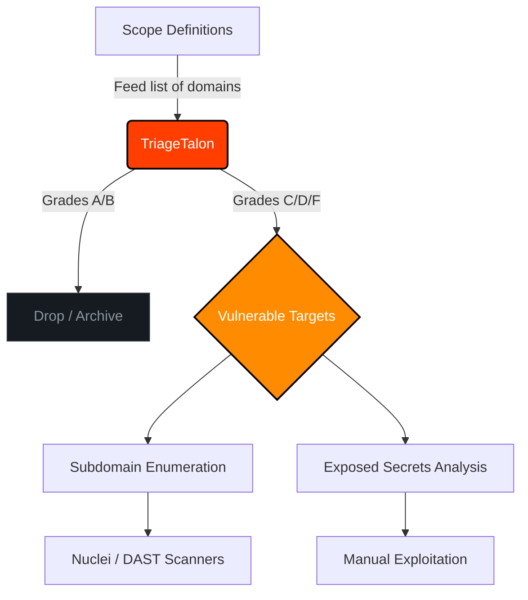

<div align="center">



[](https://opensource.org/licenses/MIT)
[](https://python.org)
[](https://rapidapi.com/BMNTR/api/ultimate-attack-surface-recon-api)
[](https://bmntr.github.io/TriageTalon/)
[]()

*Advanced Reconnaissance & Attack Surface Filtration for SecOps, DevOps, & Bug Bounty Hunters*

**Live Demo & Official Website:** [bmntr.github.io/TriageTalon](https://bmntr.github.io/TriageTalon/)

</div>

---

## Table of Contents

- [Overview](#overview)
- [Why TriageTalon?](#why-triagetalon)
- [Core Features](#core-features)
- [Workflow Architecture](#workflow-architecture)
- [Installation](#installation)
- [Usage Guide](#usage-guide)
  - [Getting Your API Key](#getting-your-api-key)
  - [Basic Scanning](#basic-scanning)
  - [Batch Processing](#batch-processing)
- [Pro Tip: Global Alias](#pro-tip-global-alias)
- [Disclaimer](#disclaimer)

---

## Overview

**TriageTalon** is an aggressive, high-speed reconnaissance CLI tool built for Security Teams, DevOps, and Bug Bounty Hunters. Whether you are monitoring your own corporate infrastructure for misconfigurations or hunting for zero-days, the biggest bottleneck is time -- spending days scanning hardened infrastructure yields low returns. 

TriageTalon flips this paradigm. By leveraging the edge-computed [Ultimate Attack Surface & Recon API](https://rapidapi.com/BMNTR/api/ultimate-attack-surface-recon-api), it actively filters out hardened targets and isolates the weakest links in your scope (Grades C, D, and F).

It operates on a simple philosophy: **Hunt where the armor is thinnest.**

## Why TriageTalon?

Traditional recon pipelines require chaining multiple tools (Subfinder, HTTPX, Nuclei) and waiting hours for results. TriageTalon performs instantaneous, API-driven triage:

- **Skip the Noise**: Automatically drops targets with "A" or "B" security grades.
- **Zero Overhead**: Does not rely on local heavy-lifting or bandwidth exhaustion. The API handles the crawling.
- **High Signal-to-Noise**: Only alerts you when actionable misconfigurations are definitively proven.

## Core Features

- **Security Grading (A-F)**: Automated scoring based on HSTS, CSP, X-Frame-Options, and other HTTP security headers.
- **Subdomain Discovery**: Returns live, resolved subdomains directly from the API.
- **Sensitive Files Check**: Probes for exposed `.git`, `.env`, and `robots.txt` files.
- **DNS & Mail Security**: Maps A, AAAA, MX, NS, and TXT records. Detects missing SPF/DMARC.
- **WHOIS Intelligence**: Live RDAP queries for domain age, registrar, and expiration dates.
- **Pipeline Ready**: Designed to integrate into larger bash scripts or CI/CD recon pipelines.

---

## Workflow Architecture

TriageTalon acts as the vanguard of your recon pipeline. Here is how it fits into professional SecOps and Bug Bounty workflows:



---

## Installation

Ensure you have Python 3.8+ installed.

```bash
# Clone the repository
git clone https://github.com/BMNTR/TriageTalon.git

# Navigate to the directory
cd TriageTalon

# Install as a global package (Recommended)
pip install -e .

# Now you can use the 'talon' command anywhere!
```

---

## Usage Guide

### Getting Your API Key

To use TriageTalon, you need a **free RapidAPI key**. Follow these steps:

**Step 1: Create a RapidAPI Account**

Go to [rapidapi.com](https://rapidapi.com/) and sign up for a free account. You can register using your email, Google, or GitHub account.

**Step 2: Subscribe to the API**

Visit the [Ultimate Attack Surface & Recon API](https://rapidapi.com/BMNTR/api/ultimate-attack-surface-recon-api) page. Click the **Pricing** tab at the top of the page, then select the **Free Tier** and click **Subscribe** (no credit card required). You can check the exact monthly request limit on the Pricing tab.

**Step 3: Copy Your API Key**

After subscribing, look at the left sidebar and click on **Endpoints** (or click **Open playground**). In the middle of the screen, you will see the API testing playground. Look for the Header Parameters section to find the field labeled `X-RapidAPI-Key`. Manually highlight and copy the key text itself (e.g., `e5f3...`). Do NOT click the copy icon on the right side of the screen, as it will copy the entire code snippet instead of just the key.

> **Tip:** You can test the API directly from the RapidAPI playground before using the CLI. Enter a domain in the `domain` parameter field and click **Test Endpoint** to see a live response.

**Step 4: Use Your Key**

Pass the key to TriageTalon using any of these methods:

```bash
# Option A: Pass directly via flag (quickest for trying it out)
talon -d example.com -k YOUR_API_KEY

# Option B: Set as environment variable (recommended for daily use,
# so you don't have to type your key every time)
export RAPIDAPI_KEY="YOUR_API_KEY"    # Linux/macOS
$env:RAPIDAPI_KEY = "YOUR_API_KEY"    # Windows PowerShell
talon -d example.com

# Option C: Hardcode in script (edit line 22 of recon.py)
RAPIDAPI_KEY = "YOUR_API_KEY"
```

### 1. Interactive Dashboard (TUI)

The most powerful way to use TriageTalon is via the interactive Textual TUI. Simply run the tool with no arguments:

```bash
talon
```

This launches a full-screen, dual-card dashboard:
- **Left Panel (Summary):** View the security grade, exposures, DNS records, and WHOIS intelligence.
- **Right Panel (Raw JSON):** Explore the complete raw API response with syntax highlighting.

**TUI Commands:**
- `example.com` : Type any domain and press Enter to scan.
- `copy`        : Copies the raw JSON response of the last scan to your clipboard.
- `copy <#>`    : Copies the JSON response from a specific scan index in history.
- `history`     : Displays a summary table of all domains scanned in the current session.
- `help`        : View all available commands.
- `clear`       : Clears the terminal output screen.
- `quit`        : Exits the dashboard.

### 2. Single Target CLI Scan

If you prefer standard CLI output without the full-screen interactive dashboard, use the `-d` flag:

```bash
talon -d example.com
```

### 3. Batch Processing & Concurrency

When dealing with a massive scope (e.g., hundreds of wildcard subdomains), feed a text file into TriageTalon. It now supports multi-threading for blazing-fast triage:

```bash
# Scan with 10 concurrent threads (default is 5)
talon -l targets.txt -t 10
```

### 4. Bug Bounty Pipelines (Silent Mode & JSON Export)

TriageTalon is built to be chained with other tools. Use Quiet Mode (`-q`) to suppress the UI and only print vulnerable domains (Grades C, D, F). 
You can also export the full raw JSON (`-o`) or print raw JSON directly to stdout (`--json`) for pipelining with `jq`:

```bash
# Pipe vulnerable targets directly to nuclei
talon -l scope.txt -q | nuclei -t vulnerabilities/

# Export results to a JSON file
talon -l scope.txt -o results.json

# Print raw JSON to stdout and parse it with jq (Linux/macOS)
talon -d example.com --json | jq '.["example.com"].subdomains'

# Note for Windows PowerShell users: Escape the quotes with backslashes
talon -d example.com --json | jq '.[\"example.com\"].subdomains'
```

## Pro Tip: Global Command

Since we introduced `setup.py`, you no longer need manual aliases. Just run `pip install -e .` in the project directory, and the `talon` command will be permanently available in your PowerShell or bash terminal!

---

## Disclaimer

This tool is designed **strictly for authorized security auditing, infrastructure monitoring, and ethical research**. The authors are not responsible for any misuse, illegal access, or damage caused by this software. Always ensure you have explicit permission to test the targets in your scope.
