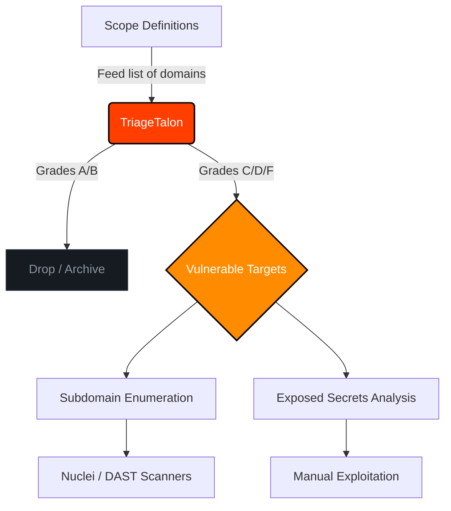

<div align="center">


[](https://opensource.org/licenses/MIT)
[](https://python.org)
[](https://rapidapi.com/BMNTR/api/ultimate-attack-surface-recon-api)
[]()
[]()

*Advanced Reconnaissance & Attack Surface Filtration for Bug Bounty Hunters*

</div>

---

## Table of Contents

- [Overview](#overview)
- [Why TriageTalon?](#why-triagetalon)
- [Core Features](#core-features)
- [Workflow Architecture](#workflow-architecture)
- [Installation](#installation)
- [Usage Guide](#usage-guide)
  - [Getting Your API Key](#getting-your-api-key)
  - [Basic Scanning](#basic-scanning)
  - [Batch Processing](#batch-processing)
- [Pro Tip: Global Alias](#pro-tip-global-alias)
- [Disclaimer](#disclaimer)

---

## Overview

**TriageTalon** is an aggressive, high-speed reconnaissance CLI tool built specifically for the Bug Bounty community. In modern bug hunting, the biggest bottleneck is time -- spending days fuzzing and testing hardened infrastructure yields low returns. 

TriageTalon flips this paradigm. By leveraging the edge-computed [Ultimate Attack Surface & Recon API](https://rapidapi.com/BMNTR/api/ultimate-attack-surface-recon-api), it actively filters out hardened targets and isolates the weakest links in your scope (Grades C, D, and F).

It operates on a simple philosophy: **Hunt where the armor is thinnest.**

## Why TriageTalon?

Traditional recon pipelines require chaining multiple tools (Subfinder, HTTPX, Nuclei) and waiting hours for results. TriageTalon performs instantaneous, API-driven triage:

- **Skip the Noise**: Automatically drops targets with "A" or "B" security grades.
- **Zero Overhead**: Does not rely on local heavy-lifting or bandwidth exhaustion. The API handles the crawling.
- **High Signal-to-Noise**: Only alerts you when actionable misconfigurations are definitively proven.

## Core Features

- **Security Grading (A-F)**: Automated scoring based on HSTS, CSP, X-Frame-Options, and other HTTP security headers.
- **Subdomain Discovery**: Returns live, resolved subdomains directly from the API.
- **Sensitive Files Check**: Probes for exposed `.git`, `.env`, and `robots.txt` files.
- **DNS & Mail Security**: Maps A, AAAA, MX, NS, and TXT records. Detects missing SPF/DMARC.
- **WHOIS Intelligence**: Live RDAP queries for domain age, registrar, and expiration dates.
- **Pipeline Ready**: Designed to integrate into larger bash scripts or CI/CD recon pipelines.

---

## Workflow Architecture

TriageTalon acts as the vanguard of your recon pipeline. Here is how it fits into a professional Bug Bounty workflow:



---

## Installation

Ensure you have Python 3.8+ installed.

```bash
# Clone the repository
git clone https://github.com/BMNTR/TriageTalon.git

# Navigate to the directory
cd TriageTalon

# Install dependencies
pip install -r requirements.txt
```

---

## Usage Guide

### Getting Your API Key

To use TriageTalon, you need a **free RapidAPI key**. Follow these steps:

**Step 1: Create a RapidAPI Account**

Go to [rapidapi.com](https://rapidapi.com/) and sign up for a free account. You can register using your email, Google, or GitHub account.

**Step 2: Subscribe to the API**

Visit the [Ultimate Attack Surface & Recon API](https://rapidapi.com/BMNTR/api/ultimate-attack-surface-recon-api) page. Click the **Pricing** tab at the top of the page, then select the **Free Tier** and click **Subscribe** (no credit card required). You can check the exact monthly request limit on the Pricing tab.

**Step 3: Copy Your API Key**

After subscribing, look at the left sidebar and click on **Endpoints** (or click **Open playground**). In the middle of the screen, you will see the API testing playground. Look for the Header Parameters section to find the field labeled `X-RapidAPI-Key`. Manually highlight and copy the key text itself (e.g., `e5f3...`). Do NOT click the copy icon on the right side of the screen, as it will copy the entire code snippet instead of just the key.

> **Tip:** You can test the API directly from the RapidAPI playground before using the CLI. Enter a domain in the `domain` parameter field and click **Test Endpoint** to see a live response.

**Step 4: Use Your Key**

Pass the key to TriageTalon using any of these methods:

```bash
# Option A: Pass directly via flag (quickest for trying it out)
python recon.py -d target.com -k YOUR_API_KEY

# Option B: Set as environment variable (recommended for daily use,
# so you don't have to type your key every time)
export RAPIDAPI_KEY="YOUR_API_KEY"    # Linux/macOS
$env:RAPIDAPI_KEY = "YOUR_API_KEY"    # Windows PowerShell
python recon.py -d target.com

# Option C: Hardcode in script (edit line 10 of recon.py)
RAPIDAPI_KEY = "YOUR_API_KEY"
```

### Basic Scanning

Scan a single domain to get an immediate posture assessment:

```bash
python recon.py -d hackerone.com -k YOUR_API_KEY
```

**Expected Output** (illustrative -- actual values will vary depending on the target):
```text
[*] TriageTalon initialized. Scanning 1 targets...

[*] Scanning: hackerone.com
    -> Grade: F | Subdomains: 42
    -> [!] POTENTIAL TARGET: Weak security headers detected!
    -> DNS A: 104.16.99.52, 104.16.100.52
    -> DNS MX: aspmx.l.google.com
    -> SPF: Present
    -> DMARC: Present
    -> Registrar: MarkMonitor Inc.
    -> Expires: 2027-06-15
    -> [!!!] CRITICAL: Exposed .env found at https://hackerone.com/.env

==================================================
[*] SCAN COMPLETE
==================================================
    Scanned:   1
    Weak (C/D/F): 1
    Strong (A/B): 0
    Failed:    0
    Exposures: 1
==================================================
```

### Batch Processing

When dealing with a massive scope (e.g., hundreds of wildcard subdomains), feed a text file into TriageTalon to let it do the heavy lifting:

```bash
# targets.txt should contain one domain per line
python recon.py -l targets.txt -k YOUR_API_KEY
```

## Pro Tip: Global Alias

Once your API key is configured (via env var or hardcode), you can create a global alias to run TriageTalon from anywhere:

```bash
# Linux / macOS (~/.bashrc or ~/.zshrc)
alias talon="python3 /path/to/TriageTalon/recon.py"

# Windows PowerShell ($PROFILE)
function talon { python C:\path\to\TriageTalon\recon.py @args }
```

Now you can triage from any directory:
```bash
talon -d target.com
talon -l scope.txt
```

---

## Disclaimer

This tool is designed **strictly for authorized bug bounty hunting and ethical security research**. The authors are not responsible for any misuse, illegal access, or damage caused by this software. Always ensure you have explicit permission to test the targets in your scope.
