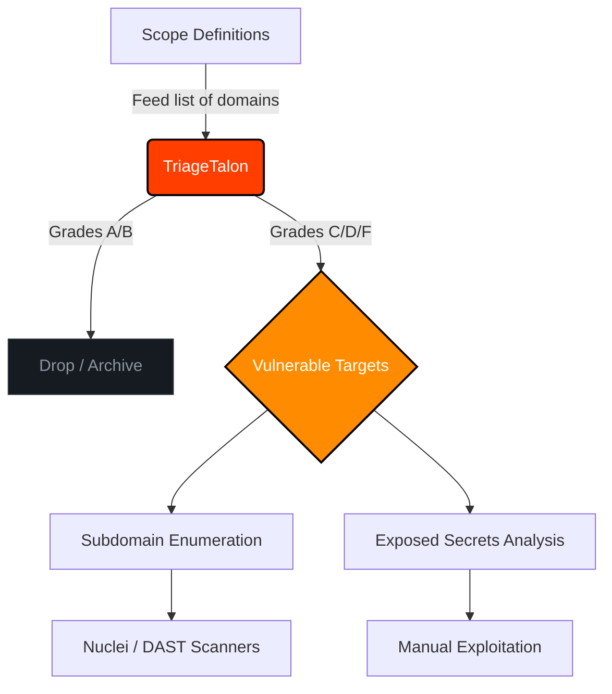

<div align="center">



[](https://opensource.org/licenses/MIT)
[](https://python.org)
[](https://rapidapi.com/BMNTR/api/ultimate-attack-surface-recon-api)
[]()
[]()

*Advanced Reconnaissance & Attack Surface Filtration for Bug Bounty Hunters*

</div>

---

## Table of Contents

- [Overview](#overview)
- [Why TriageTalon?](#why-triagetalon)
- [Core Features](#core-features)
- [Workflow Architecture](#workflow-architecture)
- [Installation](#installation)
- [Usage Guide](#usage-guide)
  - [Basic Scanning](#basic-scanning)
  - [Batch Processing](#batch-processing)
- [Advanced Integration](#advanced-integration)
- [Disclaimer](#disclaimer)

---

## Overview

**TriageTalon** is an aggressive, high-speed reconnaissance CLI tool built specifically for the Bug Bounty community. In modern bug hunting, the biggest bottleneck is time—spending days fuzzing and testing hardened infrastructure yields low returns. 

TriageTalon flips this paradigm. By leveraging the edge-computed [Ultimate Attack Surface API](https://rapidapi.com/BMNTR/api/ultimate-attack-surface-recon-api), it actively filters out hardened targets and isolates the weakest links in your scope (Grades C, D, and F).

It operates on a simple philosophy: **Hunt where the armor is thinnest.**

## Why TriageTalon?

Traditional recon pipelines require chaining multiple tools (Subfinder, HTTPX, Nuclei) and waiting hours for results. TriageTalon performs instantaneous, API-driven triage:

- **[::] Skip the Noise**: Automatically drops targets with "A" or "B" security grades.
- **[::] Zero Overhead**: Does not rely on local heavy-lifting or bandwidth exhaustion. The API handles the crawling.
- **[::] High Signal-to-Noise**: Only alerts you when actionable misconfigurations (like exposed `.env` files or missing critical headers) are definitively proven.

## Core Features

- **[::] Security Grade Assessment**: Instantly grades the target's security posture based on modern HTTP header configurations (HSTS, CSP, X-Frame-Options, etc.).
- **[::] Secrets Exposure Hunting**: Actively probes for `.env`, `.git`, `.DS_Store`, and `wp-config.php` exposures in real-time.
- **[::] Subdomain Discovery Integration**: Returns live, resolved subdomains directly from the API endpoint.
- **[::] Pipeline Ready**: Designed to be integrated into larger bash scripts or CI/CD recon pipelines.

---

## Workflow Architecture

TriageTalon acts as the vanguard of your recon pipeline. Here is how it fits into a professional Bug Bounty workflow:



---

## Installation

Ensure you have Python 3.8+ installed.

```bash
# Clone the repository
git clone https://github.com/BMNTR/TriageTalon.git

# Navigate to the directory
cd TriageTalon

# Install dependencies
pip install -r requirements.txt
```

---

## Usage Guide

To use TriageTalon, you must obtain a **RapidAPI Key**. The free tier provides enough requests for daily bug bounty hunting.

1. Go to [Ultimate Attack Surface & Recon API](https://rapidapi.com/BMNTR/api/ultimate-attack-surface-recon-api).
2. Click **Subscribe** (Free Tier).
3. Copy your `x-rapidapi-key`.

### Basic Scanning

Scan a single domain to get an immediate posture assessment:

```bash
python recon.py -d hackerone.com -k YOUR_API_KEY
```

**Expected Output:**
```text
[*] TriageTalon initialized. Scanning 1 targets...

[*] Scanning: hackerone.com
    ↳ Grade: F | Subdomains: 42
    ↳ [!] POTENTIAL TARGET: Weak security headers detected!
    ↳ [!!!] CRITICAL: Exposed env found at https://hackerone.com/.env
```

### Batch Processing

When dealing with a massive scope (e.g., hundreds of wildcard subdomains), feed a text file into TriageTalon to let it do the heavy lifting:

```bash
# targets.txt should contain one domain per line
python recon.py -l targets.txt -k YOUR_API_KEY
```

---

## Advanced Integration

For elite hunters, TriageTalon can be hardcoded with your API key so you don't have to pass the `-k` flag every time.

Open `recon.py` and replace the placeholder:
```python
RAPIDAPI_KEY = "YOUR_ACTUAL_API_KEY_HERE"
```

Once hardcoded, you can alias it in your `.bashrc` or `.zshrc`:
```bash
alias talon="python3 /path/to/TriageTalon/recon.py"
```

Now you can triage targets globally from any directory:
```bash
talon -d target.com
```

---

## Disclaimer

This tool is designed **strictly for authorized bug bounty hunting and ethical security research**. The authors are not responsible for any misuse, illegal access, or damage caused by this software. Always ensure you have explicit permission to test the targets in your scope.
