<div align="center">



[](https://opensource.org/licenses/MIT)
[](https://python.org)
[](https://rapidapi.com/BMNTR/api/ultimate-attack-surface-recon-api)
[]()

</div>

---

## Table of Contents

- [About The Project](#about-the-project)
- [Features](#features)
- [Installation](#installation)
- [Usage](#usage)
- [Powered By](#powered-by)

## About The Project

**TriageTalon** is a lightning-fast recon tool for Bug Bounty hunters. It automatically scans your scope domains, resolves subdomains, checks for weak security headers (grades C, D, F), and actively hunts for exposed sensitive files (like `.env` or `.git`).

Instead of wasting time on hardened targets, TriageTalon filters your list so you only spend time on the most vulnerable assets.

## Features

- **[::] Speed**: Powered by serverless edge functions. Scans usually complete in < 2 seconds.
- **[::] Weakness Detection**: Automatically flags targets with poor security grades.
- **[::] Exposure Hunting**: Checks for exposed `.env` and `.git` config files instantly.
- **[::] Subdomain Discovery**: Pulls live subdomains for pivoting.

## Installation

```bash
git clone https://github.com/BMNTR/TriageTalon.git
cd TriageTalon
pip install -r requirements.txt
```

## Usage

You will need a free API key to run this tool.
1. Get your free API key from: [Ultimate Attack Surface API on RapidAPI](https://rapidapi.com/BMNTR/api/ultimate-attack-surface-recon-api)
2. Run the tool using the `-k` flag, or hardcode it in the `recon.py` script.

**Scan a single domain:**
```bash
python recon.py -d example.com -k YOUR_API_KEY
```

**Scan a list of domains:**
```bash
python recon.py -l targets.txt -k YOUR_API_KEY
```

## Powered By
This tool acts as a CLI wrapper for the [Ultimate Attack Surface & Recon API](https://rapidapi.com/BMNTR/api/ultimate-attack-surface-recon-api). 
