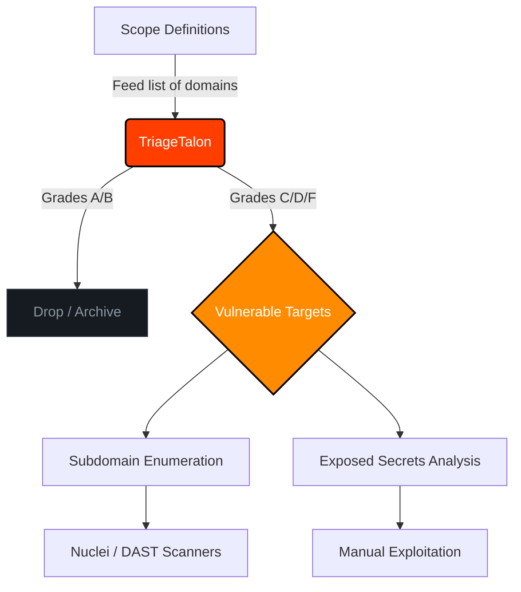

<div align="center">


[](https://opensource.org/licenses/MIT)
[](https://python.org)
[](https://rapidapi.com/BMNTR/api/ultimate-attack-surface-recon-api)
[]()
[]()

*Advanced Reconnaissance & Attack Surface Filtration for Bug Bounty Hunters*

</div>

---

## Table of Contents

- [Overview](#overview)
- [Why TriageTalon?](#why-triagetalon)
- [Core Features](#core-features)
- [Workflow Architecture](#workflow-architecture)
- [Installation](#installation)
- [Usage Guide](#usage-guide)
  - [Basic Scanning](#basic-scanning)
  - [Batch Processing](#batch-processing)
- [Advanced Integration](#advanced-integration)
- [Disclaimer](#disclaimer)

---

## Overview

**TriageTalon** is an aggressive, high-speed reconnaissance CLI tool built specifically for the Bug Bounty community. In modern bug hunting, the biggest bottleneck is time -- spending days fuzzing and testing hardened infrastructure yields low returns. 

TriageTalon flips this paradigm. By leveraging the edge-computed [Ultimate Attack Surface & Recon API](https://rapidapi.com/BMNTR/api/ultimate-attack-surface-recon-api), it actively filters out hardened targets and isolates the weakest links in your scope (Grades C, D, and F).

It operates on a simple philosophy: **Hunt where the armor is thinnest.**

## Why TriageTalon?

Traditional recon pipelines require chaining multiple tools (Subfinder, HTTPX, Nuclei) and waiting hours for results. TriageTalon performs instantaneous, API-driven triage:

- **Skip the Noise**: Automatically drops targets with "A" or "B" security grades.
- **Zero Overhead**: Does not rely on local heavy-lifting or bandwidth exhaustion. The API handles the crawling.
- **High Signal-to-Noise**: Only alerts you when actionable misconfigurations are definitively proven.

## Core Features

- **Security Grading (A-F)**: Automated scoring based on HSTS, CSP, X-Frame-Options, and other HTTP security headers.
- **Subdomain Discovery**: Returns live, resolved subdomains directly from the API.
- **Sensitive Files Check**: Probes for exposed `.git`, `.env`, and `robots.txt` files.
- **DNS & Mail Security**: Maps A, AAAA, MX, NS, and TXT records. Detects missing SPF/DMARC.
- **WHOIS Intelligence**: Live RDAP queries for domain age, registrar, and expiration dates.
- **Pipeline Ready**: Designed to integrate into larger bash scripts or CI/CD recon pipelines.

---

## Workflow Architecture

TriageTalon acts as the vanguard of your recon pipeline. Here is how it fits into a professional Bug Bounty workflow:



---

## Installation

Ensure you have Python 3.8+ installed.

```bash
# Clone the repository
git clone https://github.com/BMNTR/TriageTalon.git

# Navigate to the directory
cd TriageTalon

# Install dependencies
pip install -r requirements.txt
```

---

## Usage Guide

To use TriageTalon, you must obtain a **RapidAPI Key**. The free tier provides enough requests for daily bug bounty hunting.

1. Go to [Ultimate Attack Surface & Recon API](https://rapidapi.com/BMNTR/api/ultimate-attack-surface-recon-api).
2. Click **Subscribe** (Free Tier).
3. Copy your `x-rapidapi-key`.

### Basic Scanning

Scan a single domain to get an immediate posture assessment:

```bash
python recon.py -d hackerone.com -k YOUR_API_KEY
```

**Expected Output:**
```text
[*] TriageTalon initialized. Scanning 1 targets...

[*] Scanning: hackerone.com
    -> Grade: F | Subdomains: 42
    -> [!] POTENTIAL TARGET: Weak security headers detected!
    -> DNS A: 104.16.99.52, 104.16.100.52
    -> DNS MX: aspmx.l.google.com
    -> SPF: Present
    -> DMARC: Present
    -> Registrar: MarkMonitor Inc.
    -> Expires: 2027-06-15
    -> [!!!] CRITICAL: Exposed .env found at https://hackerone.com/.env

==================================================
[*] SCAN COMPLETE
==================================================
    Scanned:   1
    Weak (C/D/F): 1
    Strong (A/B): 0
    Failed:    0
    Exposures: 1
==================================================
```

### Batch Processing

When dealing with a massive scope (e.g., hundreds of wildcard subdomains), feed a text file into TriageTalon to let it do the heavy lifting:

```bash
# targets.txt should contain one domain per line
python recon.py -l targets.txt -k YOUR_API_KEY
```

---

## Advanced Integration

TriageTalon supports three methods for providing your API key, in order of priority:

**1. CLI Flag (highest priority):**
```bash
python recon.py -d target.com -k YOUR_API_KEY
```

**2. Environment Variable:**
```bash
# Linux / macOS
export RAPIDAPI_KEY="YOUR_API_KEY"

# Windows (PowerShell)
$env:RAPIDAPI_KEY = "YOUR_API_KEY"

# Then run without -k flag
python recon.py -d target.com
```

**3. Hardcode in Script (lowest priority):**

Open `recon.py` and replace the placeholder:
```python
RAPIDAPI_KEY = "YOUR_ACTUAL_API_KEY_HERE"
```

Once configured, you can alias it for global access:
```bash
alias talon="python3 /path/to/TriageTalon/recon.py"
talon -d target.com
```

---

## Disclaimer

This tool is designed **strictly for authorized bug bounty hunting and ethical security research**. The authors are not responsible for any misuse, illegal access, or damage caused by this software. Always ensure you have explicit permission to test the targets in your scope.
